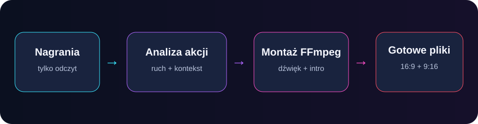

# Divithy Highlight Lab

[](https://github.com/Divithy-IT/divithy-highlight-lab/actions/workflows/checks.yml)


Lokalny warsztat do przeglądania nagrań z gier, wyszukiwania dynamicznych
fragmentów i renderowania kompilacji oraz pionowych shortsów. Materiały
źródłowe są tylko odczytywane, a wyniki trafiają do osobnego katalogu.



## Możliwości

- raport czasu, rozdzielczości, FPS i rozmiaru wszystkich nagrań;
- punktowanie ruchu i zmian obrazu przy pomocy OpenCV;
- wybór fragmentów z kontekstem przed akcją i po niej;
- kompilacje 16:9 z intro i outro przez FFmpeg;
- shortsy 9:16 z pełnym kadrem gry na rozmytym tle;
- normalizacja głośności i limiter chroniący przed nagłymi krzykami;
- opcjonalna transkrypcja i wypikanie przekleństw przez faster-whisper;
- kodowanie programowe `libx264` albo sprzętowe `h264_nvenc` na NVIDIA.

## Szybki start na Windows

```powershell
python -m venv .venv
.\.venv\Scripts\Activate.ps1
pip install -r requirements.txt
python inventory_videos.py "D:\Nagrania" --output inventory.json
python analyze_package.py --help
```

FFmpeg jest dostarczany przez `imageio-ffmpeg`, więc osobna instalacja zwykle
nie jest potrzebna. Pierwsze użycie transkrypcji pobiera wybrany model i wymaga
internetu; same nagrania nie są automatycznie wysyłane do zewnętrznej usługi.

## Typowy przebieg

1. Uruchom inwentaryzację katalogu i sprawdź raport.
2. Przeanalizuj paczkę, aby znaleźć kandydatów na najlepsze akcje.
3. Zweryfikuj proponowane zakresy przed renderem.
4. Zbuduj film główny i trzy shortsy.
5. Opcjonalnie przeanalizuj dialogi i utwórz ocenzurowaną kopię.

Najważniejsze polecenia:

```powershell
python inventory_videos.py --help
python analyze_package.py --help
python render_shorts.py --help
python censor_profanity.py --help
```

Dla cenzury dostępne są też `Analizuj_przeklenstwa.bat` i
`Utworz_wersje_ocenzurowana.bat`. Szczegóły opisuje
[CENZURA_README.md](CENZURA_README.md).

## Prywatność i bezpieczeństwo

Wideo, audio, transkrypcje, raporty zawierające prywatne ścieżki oraz katalogi
wynikowe są ignorowane przez Git. Nie dodawaj prawdziwych materiałów do
zgłoszeń. Zasady raportowania opisuje [SECURITY.md](SECURITY.md).

## Rozwój

```powershell
python -m compileall -q .
python inventory_videos.py --help
python analyze_package.py --help
python render_shorts.py --help
python censor_profanity.py --help
```

Każdy push i pull request przechodzi te kontrole automatycznie. Informacje o
wersjach są w [CHANGELOG.md](CHANGELOG.md), a zasady zmian w
[CONTRIBUTING.md](CONTRIBUTING.md).

## English

Divithy Highlight Lab is a local Python toolkit for inventorying gaming
recordings, scoring visual activity, selecting highlight candidates and
rendering 16:9 compilations plus 9:16 Shorts. It uses OpenCV, FFmpeg and an
optional local faster-whisper model. Source recordings are read-only and are
never uploaded automatically. English issues and pull requests are welcome.

## Licencja

[MIT](LICENSE) © 2026 Michał Lemanczyk.
